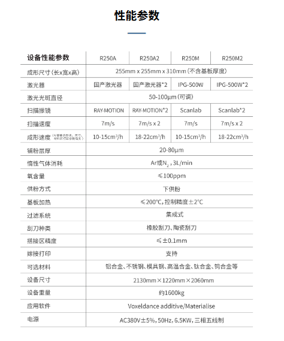
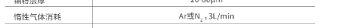

按下：
Ctrl + Shift + V
即可看到实时预览

# 3 objective functions 
## 1. 碳排放公式 (Carbon Emission) 所需参数
公式回顾：$$Min \ CE = \underbrace{[\rho \times (1 + \eta_{loss}) \times EF_{powder}]}_{\text{材料碳足迹}} + \underbrace{[\frac{P_{laser} + P_{base}}{V \times H \times LT} \times EF_{electricity}]}_{\text{能耗碳足迹}}$$

$\rho$材料密度$7.70 \ g/cm^3$  (注意换算为 $7.7 \times 10^{-6} kg/mm^3$)
手稿原文：Eq.(1)下方定义 "nominal density of SS-CX (7.70 g/cm3)" 。

$EF_{powder}$粉末碳排放因子$1.45 \ kg CO_2/kg$
手稿原文：Table 6 中 "Stainless steel" 对应的数值。

$EF_{electricity}$电力碳排放因子$0.5366 \ kg CO_2/kWh$
手稿原文：引用了中国生态环境部2022年的公告数据。

$\eta_{loss}$粉末损耗率$13\%$ (即 0.13)
手稿原文：Table 7 显示 Stainless steel 的回收利用率 (utilization rate) 为 87% 

$P_{base}$设备基础功率建议取 $1.5 \sim 3.0 \ kW$
文献推断：手稿未提及。参考 Thomas (2014) 5，激光器能耗仅占总能耗的 16%，加热和电机占大头。如果你的激光满载是 500W ($0.5kW$)，那么总功率约为 $0.5 / 0.16 \approx 3.1 kW$。减去激光，基础功率约 2.6 kW。（此方案废除×）
分析：设备的额定总功率是 $6.5 \ kW$。假设你的实验只用了单激光（根据你的论文描述 P=385-460W），那么激光器满载消耗约 $0.5 \ kW$。结论：你的 $P_{base}$ (非激光能耗：加热、风扇、运动系统、控制柜) 实际上非常高！计算：$P_{base} \approx 6.5 \ kW (\text{总}) - 1.0 \ kW (\text{激光满载余量}) = \mathbf{5.5 \ kW}$。

## 2. 综合成本公式 (Total Cost) 所需参数
公式回顾：$$Min \ Cost = \underbrace{\frac{C_{machine} + C_{labor}+C_{gas}}{V \cdot H \cdot LT}}_{\text{加工费}} + \underbrace{\rho (1+\eta_{loss}) C_{powder}}_{\text{材料费}} + \underbrace{K \cdot (100-RD)^2}_{\text{质量惩罚}}$$

$C_{powder}$粉末单价$210 \ Yuan/kg$
手稿原文：Table 8 "Metal powder: 210 Yuan/kg" 。

$C_{electricity}$电费单价$1.336 \ Yuan/kWh$
手稿原文：Table 8 "Commercial power: 1.336 Yuan/kWh" 。

$C_{labor}$人工时薪建议 $50 \sim 100 \ Yuan/h$估算：手稿提到人工成本来自中国重汽调查 8，但未给出时薪。Table 9 给出了"Processing cost" (含人工) 约为 12.52 Yuan 9，但这可能不是时薪。建议按当地技工市价估算。

$C_{machine}$机器小时费率建议 $150 \sim 200 \ Yuan/h$
计算得出：
1. 设备原值 $OV = 2,600,000$ (Table 9 Laser cladding参考值)。
2. 残值 $RV = 5\%$ 11。
3. 寿命 $T = 10$ 年。
4. 假设年工作时间 $awt = 1600$ 小时 (单班制)。计算： $\frac{2.6M \times 0.95}{10 \times 1600} \approx 154 \ Yuan/h$。

$K_{penalty}$质量惩罚系数建议 $20 \sim 50$
文献佐证：参考 Thomas (2014) 13，后处理成本约占总成本的 8% ~ 13%。
设定逻辑：假设打印 $1cm^3$ 成本约 50 元。如果致密度降 1%，需要 5 元后处理费。
$K \times (100-99)^2 = 5 \rightarrow K=5$。为了加大惩罚力度（模拟废品风险），建议设为 20-50。

新增 $Cost_{gas}$ (气体成本) —— 让模型更精准图片信息：惰性气体消耗：$Ar$ 或 $N_2$, 3L/min。应用：你之前的成本公式里虽然提到了气体，但现在有了确切的消耗速率。公式修正建议：在 $Cost_{Operation}$ 中，除了人工和机器折旧，可以精确加上气体成本：$$Cost_{Gas} = \frac{3 \ (L/min)}{60} \times \frac{1}{V \cdot H \cdot LT} \times Price_{Gas}$$(注：$1/(V \cdot H \cdot LT)$ 是打印单位体积所需的时间秒数)

## 3. 生产效率公式 (Efficiency)
$$Max \ Eff = V \times H \times LT
$$这三个变量是你的决策变量 (Decision Variables)，它们的取值范围 (Constraint Range) 已经完全包含在你的手稿中：
$V$ (速度): $700 - 1150 \ mm/s$
$H$ (扫描间距): $90 - 115 \ \mu m$
$LT$ (层厚): $80, 100, 120 \ \mu m$ 

## 为了让论文无懈可击，建议在文中补充以下说明
1. 确认 $P_{base}$：找一下你的 R250M2 设备铭牌，看它的额定功率是多少（通常写在机器背面，比如 "Rated Power 3.5kW"）。如果找不到，就引用 Thomas 的 "16% 激光占比" 理论推导一个值。(已经解决，通过查找官网，后续论文可以提及估算的方法)
2. 解释 $K_{penalty}$：引用 Thomas (2014) 关于 "Ill-structured costs" 和 "Post-processing costs (approx 8.4%)" 的数据，说明你为什么把惩罚系数设定在这个范围。

# 2025/12/6
## 论文 A novel hybrid multi-objective algorithm to solve the generalized cubic cell formation problem  思路借鉴
这篇参考论文（Bouaziz et al., 2023）的核心方法论对于解决你的大层厚LPBF多目标优化问题非常对症。你之前的困扰在于不知道如何处理非线性模型（多项式）以及如何同时平衡三个目标。
下面我结合你的具体案例（碳排放、成本、效率），详细拆解如何参考他的 Eq. 17 和 Eq. 18 来构建你自己的优化模型。
1. 核心思想：降维打击（1个主目标 + 2个约束）
   多目标优化（MOO）最难的地方在于三个目标通常是打架的。AUGMECON-R 的核心逻辑是：不要试图同时优化三个，而是“轮流坐庄”。
   *选一个做“主目标”（Main Objective）：通常选你最关心的，或者最具代表性的（比如碳排放）。
   *把另外两个变成“约束”（Constraints）：强行规定另外两个目标必须达到某个标准（$\varepsilon$），然后在这个标准下看主目标能优化到什么程度。
   *轮询（Grid Search）：通过不断调整那两个约束的标准（比如要求成本必须低于100，然后低于90，低于80...），你就能遍历出所有的可能性。

   鉴于你所面临的求解器技术限制（Gurobi 不支持非线性公式）和你搭档提供的高精度回归模型，采用这种**“先宽后严”**的策略是目前最合理、最可行的方案

   # 一、 模型参数定义 (基于你的笔记)
首先，我们将你笔记中的数据标准化，统一单位（建议统一为 mm, s, kg, Yuan, J）。
## 1. 确定性参数 (Deterministic Parameters)
基础功率 $P_{base} = 5500 \ W$ (5.5 kW，基于你对 6.5kW 总功率的推算，非常关键的参数)。
材料密度 $\rho = 7.7 \times 10^{-6} \ kg/mm^3$。
碳排放因子：
$EF_{elec} = 0.5366 \ kgCO_2/kWh = 1.49 \times 10^{-4} \ kgCO_2/kJ$。$EF_{powder} = 1.45 \ kgCO_2/kg$。
气体消耗：
流量 $Q_{gas} = 3 \ L/min = 0.05 \ L/s$。
单价 $Price_{gas} = 53 \ Yuan/m^3 = 0.053 \ Yuan/L$ (参考表格数据)。
每秒气体成本 $C_{gas\_sec} = 0.05 \times 0.053 = 0.00265 \ Yuan/s$。
## 2. 不确定性参数 (Stochastic Scenarios)根据 PPT，我们设定三个场景 $s \in \{1, 2, 3\}$ 来体现两阶段随机规划：
场景 (s),概率 (probs​),粉末损耗率 (ηloss​),粉末单价 (Cpowder​)
  1 (悲观),  0.25,      16% (0.16),       230 Yuan/kg
  2 (正常),  0.50,      13% (0.13),       210 Yuan/kg
  3 (乐观),  0.25,      10% (0.10),       190 Yuan/kg

# 二、 目标函数重构 (加入“冲突项”)
这是方案二的灵魂。我们将原公式中的 $(100-RD)^2$ 移除（放入后处理），改为引入后处理成本函数。
## 目标 1：期望综合成本 (Min Expected Cost)
$$Min \ Cost = \underbrace{\frac{C_{time}}{V \cdot H \cdot LT}}_{\text{Operation}} + \underbrace{E[C_{mat}]}_{\text{Material}} + \underbrace{Cost_{Post}(LT, V)}_{\text{Post-process}} + \underbrace{Cost_{Health}(P)}_{\text{Equipment}}$$
各项拆解：打印成本： $C_{time}$ 是机器、人工、气体的每秒总花费；分母是体积构建率 ($mm^3/s$)。
期望材料成本：
$$E[C_{mat}] = \sum_{s=1}^{3} prob_s \times \left[ \rho \cdot (1 + \eta_{loss, s}) \cdot C_{powder, s} \right]$$
动态后处理成本 (制造冲突的关键)： 设定一个阶梯函数或线性函数。假设层厚越大，表面越粗糙，打磨时间越长。除了层厚带来的阶梯效应外，扫描速度 ($V$) 越快，熔池越不稳定，表面粗糙度越差，导致后续打磨抛光的成本非线性上升。这限制了无脑追求极速。
$$Cost_{Post} = C_{base\_post}(LT) \times (1 + \alpha \cdot V)$$
建议设定值：
$LT=80$: $Cost_{post} = 20 \ Yuan/cm^3$ (基准)
$LT=100$: $Cost_{post} = 25 \ Yuan/cm^3$ (增加 25%)
$LT=120$: $Cost_{post} = 35 \ Yuan/cm^3$ (增加 75%，惩罚大层厚的粗糙度)

$Cost_{Health}$ (设备健康成本) 
$$Cost_{Health} = \omega_{p} \cdot P$$
参数： $\omega_{p} = 0.01$ (惩罚权重)
物理意义： 虽然激光器电费占比不高，但长期高功率 ($P$) 满负荷运行会加速核心光学部件的老化，增加维护风险。引入此项微量惩罚，迫使算法在“非必要”情况下避免触碰设备物理极限 (460W)。
数学作用： 此项同时起到了正则化 (Regularization) 的作用，消除了帕托前沿的退化 (Degeneracy)，解决了数值计算中的除零问题。

## 目标 2：期望碳排放 (Min Expected Carbon)
$$Min \ CE = \underbrace{\frac{(P_{laser} + P_{base}) \cdot EF_{elec}}{V \cdot H \cdot LT}}_{\text{打印能耗碳}} + \underbrace{E[CE_{mat}]}_{\text{期望材料碳}}$$
注意： $P_{laser}$ 是变量 $P$， $P_{base}$ 是常数 5500W。
期望材料碳：$$E[CE_{mat}] = \sum_{s=1}^{3} prob_s \times \left[ \rho \cdot (1 + \eta_{loss, s}) \cdot EF_{powder} \right]$$
## 目标 3：生产效率 (Max Efficiency)
$$Max \ Eff = V \times H \times LT$$
## 三、 约束条件 (防止塌陷的物理防线)
为了保证优化结果在物理上是可行的（能熔化粉末），必须加入你之前确认的 ED 窗口约束。
$$30 \le \frac{P}{V \cdot H \cdot LT} \le 70$$
Gurobi 线性化写法：
$P \ge 30 \times V \times H \times LT$
$P \le 70 \times V \times H \times LT$

## 目标 4：工艺鲁棒性指数 (PRI)
我们不再单纯最大化 RD，而是最小化“缺陷风险”与“工艺不稳定性”的加权和。
$$\min f_4(\mathbf{x}) = \underbrace{(100 - \widehat{RD}(\mathbf{x}))^2}_{\text{Part I: Quality Loss}} + \lambda \cdot \underbrace{\left( \frac{E_v(\mathbf{x}) - E_{target}}{E_{range}} \right)^2}_{\text{Part II: Process Instability}}$$
### 参数解释 (全部来自现有数据)
#### Part I: 质量损失 (Quality Loss)
采用 田口损失函数 (Taguchi Loss Function) 的平方形式。
含义：RD 偏离 100% 越远，惩罚越重（平方级）。当 RD 接近 100% 时（例如 99.9% 到 99.95%），惩罚的减少量变得微乎其微。这自然解决了导师担心的“盲目追求 100%”问题，因为边际收益递减。
#### Part II: 工艺不稳定性 (Process Instability)
利用你现有的 能量密度 ($E_v = \frac{P}{V \cdot H \cdot LT}$)。
$E_{target}$ (目标能量密度)：取你工艺窗口 $30 \sim 70 \ J/mm^3$ 的中心值，即 $50 \ J/mm^3$。
$E_{range}$ (归一化范围)：半窗口宽度，即 $20 \ J/mm^3$。
含义：我们希望算法寻找高 RD 的解，但前提是能量密度尽量靠近 50 J/mm³ 这个安全中心区。
物理意义：避免算法为了凑高 RD 而跑到工艺窗口的边缘（比如 $E_v=30$ 的欠熔合边缘，或 $E_v=70$ 的匙孔边缘）。边缘区域通常意味着质量波动大、不可靠。

# 代码分层架构设计
## 第一层：配置与数据层 (Configuration & Data Layer)
作用： 集中管理所有的物理参数、经济参数和不确定性场景。为什么重要： 你的参数（如粉末价格、P_base）有了更新（如基于图片证据），集中在这里修改可以避免“改漏了”的情况。
输入内容：
确定性参数： $P_{base}$ (5500W), $C_{machine}$, $C_{gas}$, $EF_{elec}$ 等。
随机场景 (Scenarios)： 定义三个场景的字典列表（概率、粉末损耗率、粉末价格）。
后处理成本映射 (Post-processing Map)： 定义 80/100/120um 对应的后处理成本系数（这是制造冲突的关键）。
决策变量边界： $P, V, H$ 的上下界。
## 第二层：数学建模层 (Mathematical Modeling Layer) —— 核心引擎
作用： 利用 Pyomo 构建单个层厚 ($LT$) 下的优化模型。这是 PyAugmecon 能够调用的标准接口。
关键逻辑：
1. 接收参数： 接收一个固定的 $LT$ 值作为输入。
2. 定义变量： 定义 $P, V, H$ 为优化变量。
3. 处理非线性 (Gurobi 适配)：定义辅助变量 BuildRate ($= V \cdot H \cdot LT_{const}$)。注意：因为 LT 是常数，VH 是二次项，Gurobi 开启 NonConvex 后可直接处理，不需要复杂的对数变换。
4. 构建目标函数 (ObjectiveList)：计算期望成本 ($E[Cost]$) 和期望碳排放 ($E[Carbon]$)。
注意：PyAugmecon 默认最大化，对于最小化目标需乘以 -1。
5. 添加物理约束： 写入能量密度窗口约束 ($30 \le ED \le 70$)。
6. 返回模型： 将构建好的 model 对象返回给调用者。
## 第三层：分层优化执行层 (Stratified Execution Layer)
作用： 实现“分层策略”，循环调用求解器。关键逻辑：
循环控制： 遍历 for lt_val in [80, 100, 120]:。
实例化模型： 调用“第二层”的函数，传入当前的 $LT$，获取一个具体的 Pyomo 模型。
配置求解器：实例化 PyAugmecon 对象。
关键设置： 传入 solver_opts={'NonConvex': 2, 'MIPGap': 0.01} 激活 Gurobi 的非凸二次规划能力。
设置帕托点数量 (grid_points)。执行求解： 
调用 .solve()。
数据暂存： 将该 $LT$ 下算出的所有帕托解（Pareto Solutions）提取并打上标签（如 LT=80），存入总结果列表。
## 第四层：后处理与筛选层 (Post-processing & Screening Layer)
作用： 执行“后验筛选”策略，清洗数据并可视化。
关键逻辑：
RD 预测与筛选：加载你搭档的非线性 RD 回归公式。遍历第三层产出的所有解，计算预测致密度。硬剔除： 丢弃 $RD < 99.5\%$ 的解。
质量惩罚计算：(可选) 对剩下的解，加上之前移除的 $(100-RD)^2$ 惩罚成本，更新最终得分。
最终决策 (Decision Making)：使用 TOPSIS 或 熵权法，从剩下的优质解中选出那个“绿色圆点” (Best Compromise Solution)。
可视化： 绘制 3D 帕托前沿图（区分不同 $LT$ 的点的颜色）。

# 项目文件结构
My_LPBF_Research/
│
├── config.py              # 第一层：配置数据 (存放所有参数)
├── model_builder.py       # 第二层：模型构建 (定义 Pyomo 模型函数)
├── post_process.py        # 第四层：后处理 (RD筛选、计算最终得分)
├── main.py                # 第三层：主程序 (分层循环、调用求解器)
│
└── results/               # 存放输出结果 (Excel, 图片)