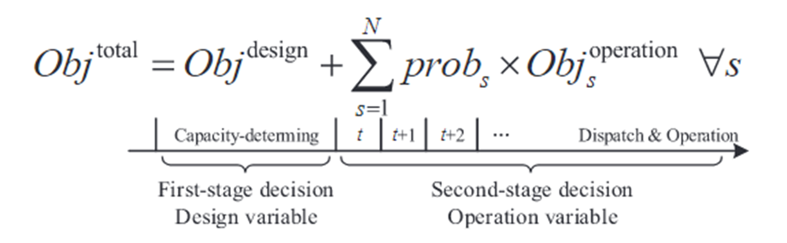
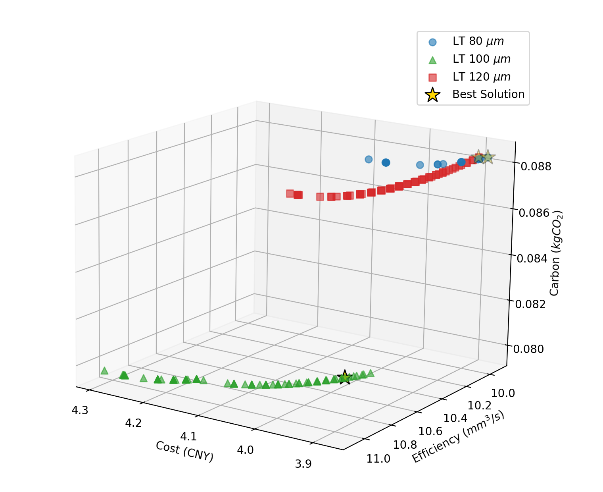

# 目前完成的工作
## 1.高保真建模（核心升级）
没有使用简化的线性模型，而是将复杂的**二阶多项式回归模型（含交互项 $P \times V$ 等）**直接写入了 Pyomo/Gurobi 的约束中    RD >= 99.5

这意味着： 求解器（Gurobi）在搜索最优解时，是“看着”你的致密度公式在找的。它找到的解不仅仅是“可能行”，而是数学上严格满足 $RD \ge 99.5\%$ 的解。这比之前的“先优化后筛选”要高级得多，因为它能找到那些紧贴着质量边界（Boundary）的极致优化点。

## 2.不确定性量化（Stochastic Programming）

设计来源于学姐提供的方向，根据参考论文提出的"Priori approach"。这种方法的核心思想是：在不确定性发生之前（Stage 1）做出决策，以优化不确定性发生之后（Stage 2）的期望目标值。
### 第一阶段（Stage 1: Here-and-Now）：
决策变量： 工艺参数 $P, V, H, LT$
含义： 这些参数是现在就必须确定的，一旦设定，打印机就开始工作，不能随意更改。
### 第二阶段（Stage 2: Wait-and-See）：
随机参数： 粉末价格（Price）、粉末损耗率（Loss Rate）。
含义： 这些是未来可能波动的市场或技术因素。
目标： 最小化这些因素在不同场景下的期望成本和期望碳排放。

### 展开为基于场景（Scenario-based） 的公式，就是代码中使用的形式：$$Min \ Z = C_{inv}(x) + \sum_{s=1}^{S} \pi_s \cdot C_{op}(x, \xi_s)$$
$Z$ (Objective Function)： 你的总目标（Cost 或 Carbon）。
$x$ (First-stage Variables)： 你的 $P, V, H$。
$C_{inv}(x)$ (Deterministic Cost)： 你的固定加工费（机器折旧、人工、气体、电费）。这部分虽然受速度影响，但它是确定的物理过程，不随市场波动。
$\pi_s$ (Probability)： 场景发生的概率。
$C_{op}(x, \xi_s)$ (Second-stage Cost)： 在特定场景 $s$ 下的材料成本。这部分是“波动的”。

### 何设计内容
#### 步骤一：不确定性建模 (Uncertainty Modeling)
描述： "参考 Wang et al. (2020) 的场景树方法，我通过离散化处理，将连续的市场波动简化为三个典型的离散场景（Scenario Tree），以捕捉 LPBF 生产中的外部风险。"
在 config.py 中定义了三个场景
#### 步骤二：构建期望目标函数 (Formulating Expected Objectives)
描述： "为了避免单一确定性参数带来的'优化过度'风险（即方案只在特定价格下最优，一旦价格波动就失效），我采用**风险中性（Risk-Neutral）**的建模策略，优化加权期望值。"
设计亮点： 你不仅仅是算一个数，你是把三个平行宇宙的成本算出来，然后按概率加权。
代码体现在test.py
#### 步骤三：嵌入非线性约束求解 (Integration with Constraints)
"最后，我将这个随机目标函数嵌入到包含非线性物理约束（如致密度回归模型）的全局优化框架中。"

### 设计相比“非随机”方法的优势（The "Value"）

如果不用随机规划（Deterministic）： 可能只会用“正常场景”的数据去算。结果可能是：算法为了省钱，选了一个极其依赖“低损耗率”的激进参数。一旦现实中损耗率稍微变高（变成悲观场景），成本就会激增。
用了随机规划（你的设计）： 你的模型在优化时，已经“看到”了那个悲观场景的存在。因此，算法会倾向于选择一个**稍微保守一点、但更稳健（Robust）**的参数组合。即使发生悲观情况，成本也不会失控。

## 3.TOPSIS
在我的项目中，TOPSIS (Technique for Order Preference by Similarity to Ideal Solution) 算法扮演着“最终决策者”的角色

在多目标优化（MOO）中，求解器（如 PyAugmecon/Gurobi）生成的是一组帕托最优解集（Pareto Optimal Set）。这些解在数学上是平等的（例如：一个解成本最低但效率低，另一个解效率最高但成本高），无法单纯从数学上说哪一个“绝对最好”。

TOPSIS 的作用就是引入人为偏好（权重），从这组成千上万个“数学最优解”中，挑选出一个最符合你实际工程需求的**“最佳折衷解（Best Compromise Solution）”**。

### 1.构造决策矩阵(Evaluation Matrix)
算法定义：建立一个 $m \times n$ 的矩阵，其中 $m$ 是候选方案（解）的数量，$n$ 是评价指标的数量。
候选者 ($m$)：经过 post_process.py 中 RD >= 99.5% 筛选后的所有合格解（来自 df_valid）。
评价指标 ($n=3$)：选择了三个核心目标作为列。
Obj_Cost (综合成本，元)
Obj_Carbon (碳排放，kg)
Obj_Efficiency (构建效率，mm³/s)
代码对应 (post_process.py)
example: 解 A：成本 50元，碳排放 0.5kg，效率 10 mm³/s解 B：成本 60元，碳排放 0.4kg，效率 15 mm³/s此时矩阵就是 $\begin{bmatrix} 50 & 0.5 & 10 \\ 60 & 0.4 & 15 \end{bmatrix}$

### 2.数据归一化 (Normalization)
算法定义：消除量纲影响（元、kg、mm³/s 单位不同，不能直接加减）。采用向量归一化法。
$$r_{ij} = \frac{x_{ij}}{\sqrt{\sum_{i=1}^{m} x_{ij}^2}}$$
“用第 i 个方案的原始值，除以这一列所有方案数值的‘整体规模’。”归一化后，所有列的数值都被压缩到了同一数量级.

### 3.构建加权矩阵 (Weighted Normalized Matrix)
算法定义：根据工程经验，给不同指标分配“权重” ($w_j$)。
$$v_{ij} = r_{ij} \times w_j$$
根据主观偏好进行设定
成本 (Cost)：权重 0.4 (40%) —— 非常看重经济性。
碳排放 (Carbon)：权重 0.2 (20%) —— 关注环保，但不是首要。
效率 (Efficiency)：权重 0.4 (40%) —— 大层厚的核心优势，非常看重。

### 4.确定正负理想解 (Determine Ideal Solutions)
算法定义：
正理想解 ($A^+$)：虚拟出的“完美方案”，每个指标都取当前列的最好值。
负理想解 ($A^-$)：虚拟出的“最差方案”，每个指标都取当前列的最差值。
指标的方向 (criteria)：
Cost: False (越小越好) $\rightarrow$ 最好值是最低成本。
Carbon: False (越小越好) $\rightarrow$ 最好值是最低排放。
Efficiency: True (越大越好) $\rightarrow$ 最好值是最高效率。
这里我是根据别人写好的库来调用的。
归一化加权后：
正理想解 ($A^+$) = [最低成本, 最低碳, 最高效率]
负理想解 ($A^-$) = [最高成本, 最高碳, 最低效率]

### 5.计算距离 (Calculate Euclidean Distances)
算法定义：计算每个候选解距离“完美解”有多远 ($D_i^+$)，距离“最差解”有多远 ($D_i^-$)。
$$D_i^+ = \sqrt{\sum (v_{ij} - v_j^+)^2}, \quad D_i^- = \sqrt{\sum (v_{ij} - v_j^-)^2}$$

### 6.计算综合得分并排序 (Calculate Similarity & Ranking)
算法定义：计算相对接近度（Score）。
$$C_i = \frac{D_i^-}{D_i^+ + D_i^-}$$
逻辑：分数 $C_i$ 越接近 1，说明该解离“最差解”越远（分子大），离“完美解”越近（分母小）。

